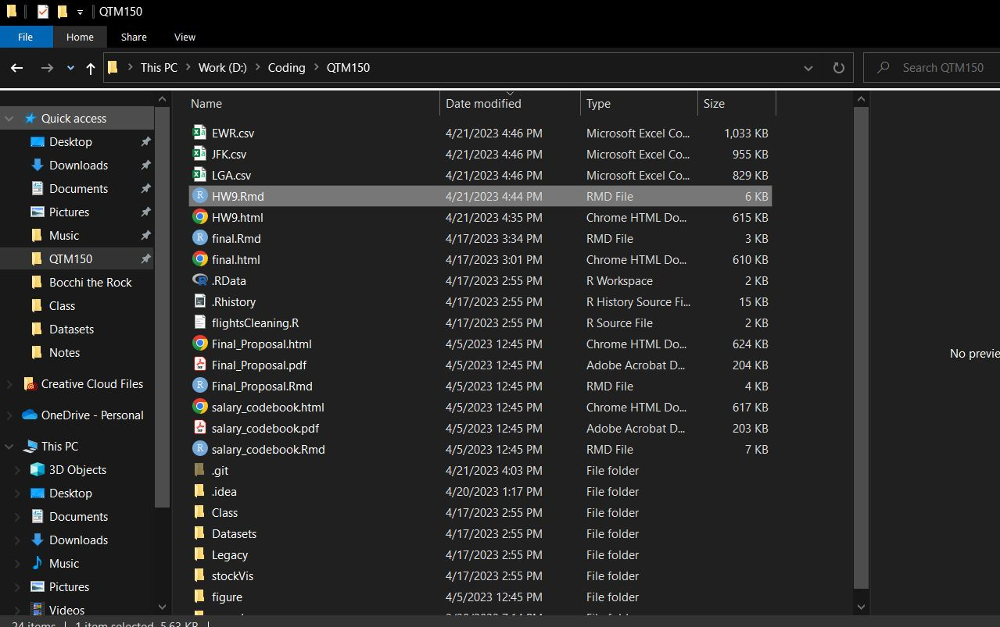

```{r setup, include=FALSE}
knitr::opts_chunk$set(echo = TRUE)

```

# Instructions

This HW is worth 10 total points.

1. Make sure to load any packages you may need right at the start. Do *NOT* include the `learnr` package, ever, unless you are writing an interactive Tutorial (which you won't do in this course) - this will cause problems.

2. Ensure that no chunks have the `include = FALSE` or `echo = FALSE` option, as I want to be able to see *all* your code and output.

3. Brief but descriptive headings and document organization (answers under headings, text near relevant code, brief explanatory text as necessary, etc.) (1 pt)

    **Look to my HW1 and RMarkdown Organization examples for how to write good headings, organize your assignment, and how much narrative text (outside of code chunks) I want. But a good rule of thumb is: explain what YOU'RE doing, NOT what YOUR CODE is doing. I do NOT need to see a repeat, line-by-line narration of what your code does - you can use code comments for that. (In complex blocks you usually want at least a comment every few lines.) I DO want to see an overall summary of what you did in your analysis.**
    
4. Write a for-loop that will, when you run the code, take the tibble `flights` and export *3* CSV files of flights *from January*: one for each origin airport (EWR, JFK, and LGA).

    Note this is actually much simpler than the for-loops you saw in the Tutorial. For example, you do *not* need to create a separate output vector - just make sure each time through the for-loop it exports a file to a folder on your computer.
    
    Also note that you need not iterate through just *numeric* vectors. You can have i (or whatever your indexing variable is) "walk" through a character vector (HINT: such as a vector of origin airport names), as well! Each time through the loop, the object `i` will take on the value of its current position in that character vector.
    
    Here's one last hint. `paste0("./", i, ".csv")` will create a path to allow you to save a file named `i`.csv to your working directory.
    
    To prove you accomplished this, provide both: a.) your for-loop code and b.) a screenshot or picture of the folder to which it saved all the files after it runs; this screenshot must include the **size** and **creation/last modified time** of each of the 3 files. To help you place the screenshot into your RMarkdown/PDF file, I've provided a codeblock below to accomplish that. (4 pts)
  

5. Let's combine your newfound expertise with creating functions and if-else statements.

    Create a "fizzbuzz" function. This is a classic computer science problem. It takes a single number as input. If the number is divisible by three, it returns “fizz”. If it’s divisible by five it returns “buzz”. If it’s divisible by three and five, it returns “fizzbuzz”. Otherwise, it returns the number.

    But make it yours. Instead of "fizz" and "buzz", choose two other silly words, nonsense words, or sounds. 
    
    And make sure to prove to me it works by running it on an input that produces your "fizz", an input that produces your "buzz", and an input that produces your "fizzbuzz." (5 pts)
    


**To submit this assignment:**

Ideally, knit straight to PDF by changing `html_document` to `pdf_document` in line 5 above. Otherwise:

1. Knit to HTML. An HTML document should open automatically in another RStudio window.

2. Click "Open in Browser" in that HTML document. It should open as a webpage in your default browser (e.g. Chrome).

3. Click Ctrl+P/Command+P, but instead of printing a hard copy on your printer click "Save as PDF."

4. Save and upload that document to Canvas.

A note on PDF formatting: you may notice that long lines of code "fly off the side of the page" when you knit to PDF. To fix this:

*If you're on a Windows machine*: 

* Install the `formatR` package

* Change your `opts_chunk$set` code line to the following: `knitr::opts_chunk$set(echo = TRUE, tidy.opts=list(width.cutoff=80), tidy=TRUE)`

That should force your code to always wrap rather than fly off the edge of the page of a PDF. Note this does not fix issues of, say, plot titles that are too long getting cut off. But it should fix all the errors with your code not wrapping.
Happy PDFing!

*If you're on a Mac*: I don't have an easy solution for you. Try and keep your lines of code under about 80 characters. Feel free to use more vertical lines of code to accomplish this. But don't waste large amounts of time formatting. I'll ask you for clarification if something critical is missing.


------BEGIN ANSWER BELOW--------

# Load Packages

```{r load packages}
pacman::p_load(tidyverse, nycflights13)
```

# `nycflights13` Janurary flights by Airport

We will use a `for` loop to export 3 CSV files of flights from January: one for each origin airport. We first create a character vector `airportnames` to hold the name codes of the airports in NYC. We then use a `for` loop to iterate through the vector, using `filter()` to find the entries in January that match the airport name for that specific `for` cycle. We then export the resulting dataframe into a csv format with `write.csv()` in conjunction with `paste0()`. This gets repeated for every airport name in our `airportnames` vector, giving us 3 CSV files that each contain the flight information in January corresponding to the airport in the name of the CSV file.

```{r cycle airports}
airportnames <- c("EWR", "LGA", "JFK")

for (ap in airportnames){
  flights %>% 
    filter(month==1,
           origin == ap) %>% 
    write.csv(paste0("./", ap, ".csv"))
}
```

Screenshot.

```{r img1, echo = FALSE, out.width = "75%", fig.cap = "*Saved airport files*"}

    # Code below is commented out so it doesn't run here, but obviously yours shouldn't be

    
```

# Fizzbuzz: Conditionals

We will use conditional statements and functions to tackle the classic "fizzbuzz" problem in computer science. We first check the strongest condition - number is evenly divisble by 3 and 5 - and return `"wtf"` if that condition is met. We then move on to the divisible by 3 condition and divisible by 5 condition, each with an `else if` statement and printing `"w"` and `"tf"` respectively. Finally, if all fails, we return the argument to the function.

```{r fizzbuzz}
wtf <- function(x) {
  if (x%%3 == 0 & x%%5 == 0){
    return ("wtf")
  }
  else if (x%%3 == 0){
    return ("w")
  }
  else if (x%%5 == 0){
    return ("tf")
  }
  else{
    return (x)
  }
}

# w
wtf(3)

# tf
wtf(5)

# wtf
wtf(15)
```

